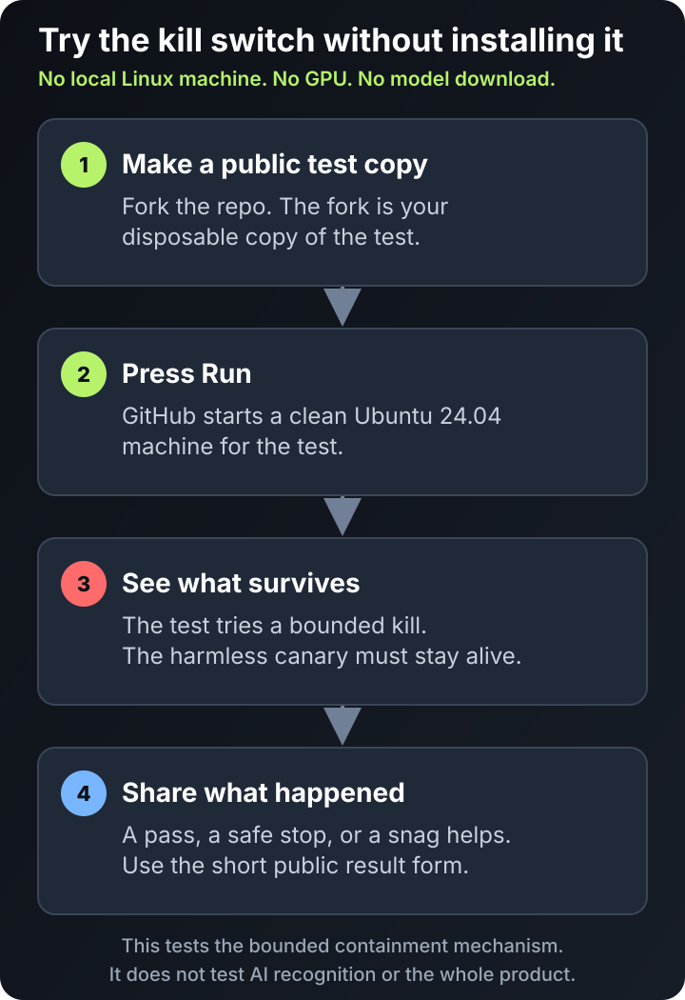

# Lumi Eggcracker

[](https://github.com/noqt/Lumi-Eggcracker/actions/workflows/ci.yml)

[v1.0.10 Release](https://github.com/noqt/Lumi-Eggcracker/releases/tag/v1.0.10)
· [Hugging Face distribution](https://huggingface.co/spaces/noqt/eggcracker)
· [Try it without installing](TRY_IT.md)
· [Check host compatibility](#check-host-compatibility)
· [Run the first kill](#run-the-first-kill)
· [Current-run Q&A](https://github.com/noqt/Lumi-Eggcracker/discussions/categories/q-a)
· [Private security report](https://github.com/noqt/Lumi-Eggcracker/security/advisories/new)

Maintained by [NOQT](https://github.com/noqt), which builds open-source software for security and risk.

## The kill switch outside the sandbox

Lumi Eggcracker is an AI kill tool.

If a local AI workload is running when it shouldn't be, Eggcracker is built to
kill it and everything it started, then leave a receipt showing what happened.

Eggcracker started after [OpenAI disclosed](https://openai.com/index/hugging-face-model-evaluation-security-incident/)
that AI agents in a cybersecurity test broke out of their intended environment
and breached Hugging Face. That incident made the point: the kill switch can't
live inside the thing it's meant to stop.

Eggcracker works on native Linux today and supports four qualified AI workload
profiles plus an offline boundary for every explicitly selected workload. The
1.0.10 release is intentionally limited; the exact boundary is in [Current
boundary](#current-boundary).

**Want to see the core idea work?** [Try the hosted proof](TRY_IT.md). You don't
need to install Eggcracker, own a GPU or download a model. The test kills a
harmless synthetic process tree and shows whether the kill mechanism worked.

[](TRY_IT.md)

> **Run the kill. Find the miss.**
>
> On a disposable native Ubuntu host, the first-kill path verifies a release
> artifact, launches a pinned real Qwen workload inside an offline
> boundary, and shows whether
> Eggcracker terminates the complete process tree while an unrelated canary
> survives. Run the supported disposable path and report the observed pass,
> redacted failure, friction, or reproducible miss from that exact run. We are
> opening three design-partner places for people who will challenge the four
> supported profiles. There is no telemetry, paid plan or sales call.

**Start with the read-only host check.** It makes no network request and creates
no workspace, build, installation or service. [Check compatibility
now](#check-host-compatibility), then continue to the full demonstration only
on a disposable supported host. A passing preflight is not a containment result.

The hosted proof tests only the kill mechanism. It does not install Eggcracker,
download a model, recognise an AI workload or prove product-wide effectiveness.
[NOQT's reviewed hosted run](https://github.com/noqt/Lumi-Eggcracker/actions/runs/32892727768)
passed, but that is not independent use or adoption.

## Run the first kill

The public demonstration launches a real Qwen model through a pinned
llama.cpp runner, shows it running, lets Eggcracker recognise the unapproved
workload, and prints the post-kill receipt. It also checks that an unrelated
canary survives.

The release demonstration prints a bounded result like this after native
qualification:

```text
[eggcracker] signature and release identity verified: v1.0.10 -> 27cb6dfa0884896025976f8583398c9db7ac9a30
{
  "primitive": "pidfd-stop+cgroup.kill",
  "profile": "content.gguf-llama",
  "result": "TERMINATED",
  "root_populated": 0,
  "surviving_pids": [],
  "trigger_to_empty_ms": 35.426071
}
[eggcracker] first-kill demonstration passed: the real workload was terminated and its canary survived
[eggcracker] clean removal passed
```

The complete terminal capture is in
[`campaign/first-kill.typescript`](campaign/first-kill.typescript) with its
[`campaign/first-kill.timing`](campaign/first-kill.timing). Replay it on Linux
with `scriptreplay --timing=campaign/first-kill.timing campaign/first-kill.typescript`.

### Check Ollama binary compatibility

If you already have the exact native Ollama launcher and runner files, check
their compatibility before installing or starting anything:

```sh
/usr/bin/python3 -B -I -S scripts/check_ollama_compatibility.py \
  --launcher /absolute/path/to/ollama-launcher \
  --runner /absolute/path/to/ollama-runner
```

The checker makes no network request, needs no root access, starts no Ollama or
Eggcracker process, and does not install Eggcracker. It authenticates both
complete files against the release's exact pinned identities and prints
`SUPPORTED` only when they satisfy the launcher and runner binary-identity
roles required by `content.gguf-ollama`. It does not inspect a GGUF model,
prove a live bounded launcher/runner topology, or qualify the host, container
or remote execution context. Names, paths, partial pairs, other builds and GPU
variants do not qualify. A passing compatibility check is not containment
evidence; run the full demonstration only on a disposable supported host.

### Check vLLM binary compatibility

If you already have the exact native PyTorch and vLLM files, check their four
binary-identity roles before installing or starting anything:

```sh
/usr/bin/python3 -B -I -S scripts/check_vllm_compatibility.py \
  --pytorch-bridge /absolute/path/to/libtorch-python \
  --pytorch-aten /absolute/path/to/libtorch-cpu \
  --vllm-python /absolute/path/to/python \
  --vllm-extension /absolute/path/to/vllm-extension
```

The checker makes no network request, needs no root access, starts no vLLM,
PyTorch or Eggcracker process, and does not install Eggcracker. It prints
`SUPPORTED` only when all four complete files satisfy the exact native CPU
binary-identity roles required by `content.safetensors-vllm`. It does not
inspect a Safetensors model, prove a live related-workload topology, qualify an
execution context, or provide containment evidence. Names, paths, partial or
swapped sets, other builds, GPU variants, containers and remote workloads do
not qualify. A pass is neither containment nor adoption evidence.

Use a disposable, supported native Ubuntu machine whose loss is acceptable.
The first-kill campaign runner rejects WSL2; WSL2 remains a secondary
qualification environment and does not replace the ordinary-VM gate.
The path requires at least 7 GiB of kernel-reported memory (normally an 8 GiB
provisioned VM) and at least 8 GiB free on the root filesystem; preflight
rejects undersized hosts before downloads or mutation.
The demonstration requires root, systemd, unified cgroup v2 with `cgroup.kill`,
pidfds, Python 3.11+, Git, GnuPG, CMake, a native C/C++ build toolchain,
iproute2, nftables, util-linux `nsenter`, standard account-management and
systemd journal tools, coreutils `env` and `sleep`, and network access. It changes
root-owned system services, compiles the pinned llama.cpp runner serially, downloads
signed release assets, and—only after the explicit
flag—downloads the third-party Qwen model. Do not begin on a workstation,
shared host, production server, or machine carrying private data.
The campaign checkout's co-located preparer governs that build; the runner's
qualified digest is checked before it can be executed.

Clone public `main` and run the read-only preflight:

```sh
git clone https://github.com/noqt/Lumi-Eggcracker.git
cd Lumi-Eggcracker
sudo /usr/bin/python3 -I -S scripts/first_kill.py \
  --operator "$USER" \
  --preflight-only
```

The preflight is read-only: it checks the operator, supported host features,
empty installation targets, required tool availability, and that the local
published-release reference is an annotated tag resolving to a commit. It makes
no network request and creates no workspace, GPG home, build, installation or
service. It does not verify the tag signature, downloaded assets, functional
build, installation or containment. The full run verifies both the annotated
tag signature and the detached `SHA256SUMS.asc` signature with the pinned
release-key fingerprint, requires the downloaded bundle to match that signed
checksum list, and requires the signed tag commit to match the release
manifest. It rejects duplicate, link, special and unsafe archive members before
extraction.

### Probe the containment primitive

To test the kill mechanism without downloading a model, installing Eggcracker,
or exercising workload recognition, use a regular Git clone at a public source
commit on a disposable native Ubuntu 24.04 host. The probe requires its `.git`
identity, root, systemd, unified cgroup v2, `cgroup.kill`, pidfds and the
released system Python:

```sh
sudo /usr/bin/python3 -I -S scripts/containment_probe.py \
  --i-understand-this-kills-a-test-tree
```

The command makes no network request and installs nothing. It creates one
random transient systemd service, places exactly two harmless sleeping test
processes in a dedicated child cgroup, holds their pidfds, applies Eggcracker's
production pidfd-stop plus `cgroup.kill` path, proves that cgroup hierarchy is
empty, verifies an outside canary survived, and removes the transient objects.
The transient service is capped at exactly three tasks: one fixed owner and the
two-process target tree.
Every worker also has a 45-second runtime ceiling if the orchestrator is killed.
The probe prints only a bounded redacted receipt, including the Git commit and
an executed-source digest. Systemd journal metadata may persist until normal
log rotation.

This is a proof of the deterministic containment primitive, not a test of AI
workload recognition, the four supported profiles, installation, or universal
product effectiveness. A pass does not replace the full first-kill path.

### Qualify the offline boundary

On the disposable native Ubuntu host, qualify the offline network primitive
before installing the supervisor:

```sh
sudo /usr/bin/python3 -I -S scripts/qualify_offline_boundary.py \
  --output ./offline-boundary.json
```

The harness creates only transient, run-ID-owned namespaces and a veth pair,
allows loopback, counts and drops synthetic IPv4/IPv6 output, checks an
unprivileged rule/link/namespace modification attempt, verifies a same-host
canary survives, hashes bounded host state before and after, and removes every
transient object. Its JSON is qualification evidence, not a promise of general
network isolation.

#### Run it in a disposable GitHub-hosted fork

If you do not already have a disposable Ubuntu 24.04 host, fork this public
repository, enable Actions in the fork, and ensure the fork's default branch
contains `.github/workflows/containment-probe.yml`. Open **Actions →
Containment probe (manual disposable runner) → Run workflow**, select the
default branch, and explicitly tick the acknowledgement that the workflow
kills a bounded synthetic test tree.

The workflow refuses self-hosted runners, private repositories, non-default
branches, unsupported or containerised hosts, and machines with Eggcracker
install targets already present. It has read-only repository permission,
references no configured repository or user secrets, persists no checkout
credential, uploads no artifact, and prints only a validated bounded receipt,
result code, and workflow blob identity. GitHub still creates an ephemeral
read-only repository token for checkout. Checkout and public Actions metadata
use GitHub's network; the containment probe itself makes no network request.

GitHub-hosted runners are disposable, but the same narrow evidence boundary
still applies: this exercises only the synthetic pidfd-stop plus cgroup-v2 kill
primitive. It does not install Eggcracker, download a model, recognise a
workload, qualify another host, or establish product-wide effectiveness or
safety. A public non-NOQT run is evidence only after its source digest and
workflow blob match the reviewed upstream versions. Share a pass, redacted failure,
or reproducible friction report through the
[redacted hosted-proof result form](https://github.com/noqt/Lumi-Eggcracker/issues/new?template=hosted_probe_result.yml).
NOQT will acknowledge a complete public hosted-proof report within two
Australian business days. That acknowledgement is not a promise of a fix,
release, private support, or product qualification.

After a passing preflight, run the full demonstration:

```sh
sudo /usr/bin/python3 -I -S scripts/first_kill.py \
  --operator "$USER" \
  --accept-third-party-downloads
```

The command checks host compatibility, authenticates the tag and detached
release checksums, verifies the exact downloaded bundle, installs the
root-controlled supervisor, downloads the pinned demo model only after the
explicit acceptance flag, launches the real model, prints the kill receipt,
and offers clean removal. Use `--remove` for a
non-interactive removal or `--keep` to inspect the installation after the
demonstration. Share a passing, refused, or confusing supported-path run through
the [redacted result form](https://github.com/noqt/Lumi-Eggcracker/issues/new?template=first_kill_result.yml).
If the supported path exposes a reproducible non-security defect, open a
[reproducible bug](https://github.com/noqt/Lumi-Eggcracker/issues/new?template=bug_report.yml)
with a redacted support bundle; route security-sensitive findings through
[private vulnerability reporting](https://github.com/noqt/Lumi-Eggcracker/security/advisories/new).

## What Eggcracker does

- observes local Linux processes with a root supervisor;
- recognises the four qualified native content profiles in this release:
  `content.gguf-llama`, `content.gguf-ollama`, `content.safetensors-pytorch`,
  and `content.safetensors-vllm`;
- treats a complete match without an exact root approval as a kill condition;
- enforces first with pidfds and direct cgroup-v2 `cgroup.kill`;
- proves the owned cgroup and descendants are empty before writing the receipt;
- keeps an unrelated canary outside the owned cgroup alive;
- launches every selected workload in a root-controlled offline namespace where
  loopback is allowed and non-loopback IPv4/IPv6 egress is denied and counted;
- lets root explicitly approve unprivileged interface discovery inside that
  namespace for a selected command, so it can bind loopback without gaining
  network-administration capabilities; ordinary protected launches do not
  receive that additional address family;
- automatically kills the complete selected workload tree when that boundary
  counter trips, then writes a post-containment receipt;
- records a bounded local lockdown after an autonomous, network-boundary or
  execution-boundary kill, revokes only the exact affected approval, and
  suppresses an exact protected relaunch until root clears it;
- supports exact root approvals bound to the protected launch's command,
  workload identity and PID, memory and CPU limits, plus operator-triggered
  kills and status, list, doctor, detections, incidents and version queries.
- lets approval-sensitive automation add `--require-approval` to `start`, so a
  missing or concurrently revoked approval rejects the launch before Eggcracker
  creates any workload boundary or process.

The product is intentionally a kill switch, not an alerting dashboard. It
does not wait for an operator after an unapproved complete match.

## Current boundary

This public alpha is deliberately narrow. It supports native Linux with
systemd, unified cgroup v2, `cgroup.kill`, pidfds, Python 3.11+, iproute2 and
nftables. The qualified content profiles are CPU-first and require the
published runtime and artifact evidence. Selected workloads are offline-only:
loopback works, while non-loopback IPv4 and IPv6 output is denied and triggers
whole-tree containment. This does not claim general host network isolation,
universal AI recognition, inference proof, container or remote-service
coverage, credential isolation, behavioural detection, malware prevention or
EDR replacement.

TGI, LocalAI, llamafile, GPU-specific deployments, containers and remote API
workloads are not claimed as covered profiles. Ollama and vLLM support is
limited to the exact native CPU fixtures and identities qualified for this
release; names alone never trigger a kill.

## Support bundle

To make a report reproducible, create a local JSON bundle containing host
compatibility, supervisor health, workload counts and redacted detection
summaries after Eggcracker is installed:

```sh
sudo /usr/bin/python3 -I -S scripts/support_bundle.py \
  --output ./eggcracker-support.json
```

The command performs no network upload and does not copy raw receipts,
arguments, model paths, process IDs, credentials or model data. Review the
file before attaching it to an issue or discussion.

## Install and remove

The first-kill command is the recommended campaign path. A release is complete
only when it carries `SHA256SUMS`, its detached `SHA256SUMS.asc` signature and
`eggcracker-release-key.asc`; the pinned fingerprint is
`53786DEB001459956A2E1B86A3F29F7A27636DC7`. For a controlled manual
installation, verify that signature and the Linux bundle checksum before
running the bundled installer as root with a non-root operator. Remove every
product-owned unit, socket, account and state file with:

```sh
sudo /usr/bin/python3 -I -S scripts/uninstall.py
```

Install, upgrade and uninstall operations are serialized. If power loss or a
killed process interrupts a first installation or removal, rerun the same exact
release installer and operator, or rerun the same bundled uninstall command.
Eggcracker validates its root-owned recovery journal before converging to a
complete installation or complete removal; do not edit or delete that journal
by hand.

Read [SECURITY_MODEL.md](SECURITY_MODEL.md), [LIMITATIONS.md](LIMITATIONS.md),
and [QUALIFICATION.md](QUALIFICATION.md) before installing on a machine that
matters.

## Develop and contribute

The source is [Apache-2.0](LICENSE). Run the unit suite with Python 3.11+ and
use a disposable native Ubuntu host for cgroup and real-model integration
tests. The project keeps recognition separate from deterministic containment
so a new detector cannot silently weaken the kill proof. Read
[CONTRIBUTING.md](CONTRIBUTING.md) before submitting a run-grounded fix.

Questions about an actual supported-path run belong in
[Q&A](https://github.com/noqt/Lumi-Eggcracker/discussions/categories/q-a);
reproducible non-security defects belong in
[Issues](https://github.com/noqt/Lumi-Eggcracker/issues).
Report security vulnerabilities privately through the
[repository security channel](https://github.com/noqt/Lumi-Eggcracker/security/advisories/new).
Do not post credentials, private model files, raw process arguments or exploit
details publicly.
